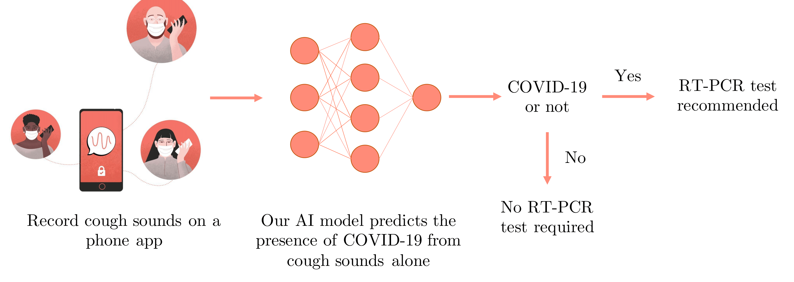

# Cough Against COVID-19

Code relase for the [Cough Against COVID-19](https://www.wadhwaniai.org/work/cough-against-covid/) Project by the [Wadhwani Institute for Artificial Intelligence](https://www.wadhwaniai.org/) supported by the Gates' Foundation.

#### [Project page](https://www.wadhwaniai.org/work/cough-against-covid/) | [Code](https://github.com/WadhwaniAI/cough-against-covid/) | [Paper (ArXiv)](https://arxiv.org/abs/2009.08790) | Data




In order to use this code, you need to follow the steps below. Please check the pre-requisites to decide whether your system is compatible.

### Pre-requisites

* CPU-only machine OR GPU-enabled machine
* Docker installed on your machine
* OS: Linux/Mac OS

> :checkered_flag: Note: This code has been tested on Mac OS and Ubuntu.

## Setup

We use docker to manage code dependencies. Please follow the steps [here](./setup) to set up all dependencies. This code works on both CPU-only machine/ GPU machine. However, it is recommended to use a GPU machine since CPU machine is very slow in runtime.

## Using our trained models

We release models trained to predict COVID-19 status from cough/contextual (symptoms etc.) metadata.

### Data version files
For the datasets used in this work, we create our own split files and those are released publicly. Please run the following (from inside docker container) to download them to `assets/data/` folder.

```bash
python setup/download_data_splits.py
```

### Pre-trained Models

Broadly, we release trained checkpoints for three kinds of models:

* Cough-based `ResNet-18` models for cough-detection
* Cough-based `ResNet-18` models for COVID-detection
* Context-based `TabNet` models for COVID-detection

Please run the following (from inside docker container) to download them to `assets/models/` folder.

```bash
python setup/download_model_ckpts.py
```

### Demo notebooks

To try out our model(s) on sample data, please follow the instructions.

* **Cough-based model**: Follow the notebook [here](demo/covid_detection_from_cough.ipynb) to predict COVID from cough using a pretrained model released with the repository. If you want to try on your own cough samples, you can record and store them in `assets/data/` and run the notebook by changing appropriate paths.

* **Context-based model**: Follow the notebook [here](demo/covid_detection_from_contextual_data.ipynb) to predict COVID from contextual features like age, symptoms, travel history etc. If you want to try on your own contextual-features, you can modify the relevant cells and run the notebook.


## Training/evaluating/fine-tuning your own models

In order to use our and other public datasets as part of this work, you will need to first download, process the datasets and then create your own configs to train models.

### Datasets

We use a combination of publicly-available datasets and our own collected datasets. Please follow the steps [here](./datasets) to download, process all datasets.

> :warning: Note: Our own dataset `wiai-facility` collected from across 27 facilities in India has not been released yet due to legal constraints that prevent us from sharing the data. We are trying to resolve those before we can release the dataset in any form.

### Training

#### Training on existing datasets
To run training on datasets downloaded in previous step, please follow the steps [here](https://github.com/WadhwaniAI/cough-against-covid/tree/pb/cough-detection/training).

#### Training any custom model on any given dataset

In order to train on your own dataset(s), first, you need to set up the dataset following steps similar to those for existing dataset given [here](./datasets). This includes downloading/setting it in the right folder structure, processing and splitting (train-validation-test).
Next, you need to create a new `.yml` config file (like [this](./configs/experiments/iclrw/cough/v9.7/adamW_1e-4.yml)) and configure the dataset section:

```yml
dataset:
  name: classification_dataset
  config:
    - name: <name-of-your-dataset>
      version: <version-of-your-dataset>
```
You can also play around with various other hyperparameters in the config like optimizer, scheduler, batch sampler method, random crop duration, network architecture etc.

:construction: More coming soon!

### Evaluation

You can evaluate your own trained models or use released model checkpoints on a given dataset. Instructions for both of these are given [here](./evaluation/README.md).

#### Evaluating any custom model on any given dataset

:construction: Coming soon!

### Documentation

:construction: Coming soon!


### Citing us

If you find this code useful, kindly consider citing our papers and starring our repository:

* [Arxiv version](https://arxiv.org/abs/2009.08790)
```
@misc{bagad2020cough,
      title={Cough Against COVID: Evidence of COVID-19 Signature in Cough Sounds}, 
      author={Piyush Bagad and Aman Dalmia and Jigar Doshi and Arsha Nagrani and Parag Bhamare and Amrita Mahale and Saurabh Rane and Neeraj Agarwal and Rahul Panicker},
      year={2020},
      eprint={2009.08790},
      archivePrefix={arXiv},
      primaryClass={cs.SD}
}
```
* [ICLR'21 AI4PH Workshop](https://aiforpublichealth.github.io/papers/ICLR-AI4PH_paper_51.pdf)
```
@misc{sharma2021impact,
      title={Impact of data-splits on generalization: Identifying COVID-19 from cough and context}, 
      author={Makkunda Sharma and Nikhil Shenoy and Jigar Doshi and Piyush Bagad and Aman Dalmia and Parag Bhamare and Amrita Mahale and Saurabh Rane and Neeraj Agrawal and Rahul Panicker},
      year={2021},
      eprint={2106.03851},
      archivePrefix={arXiv},
      primaryClass={cs.SD}
}
```


**Code Contributors** (in alphabetical order):

* [Aman Dalmia](https://www.amandalmia.com/)
* [Makkunda Sharma](https://www.linkedin.com/in/makkunda-sharma-23960814a/?originalSubdomain=in)
* [Nikhil Shenoy](https://www.linkedin.com/in/nikhil-shenoy-01a7a6141/?originalSubdomain=in)
* [Piyush Bagad](https://bpiyush.github.io/)

We thank [Jigar Doshi](https://www.linkedin.com/in/jigarkdoshi/) the Research Lead of the project for guidance.

**Reporting issues/bugs/suggestions**: If you need to bring our attention to bugs or suggest modifications, kindly create an issue and we will try our best to address it. Please feel free to contact us if you have queries. 
